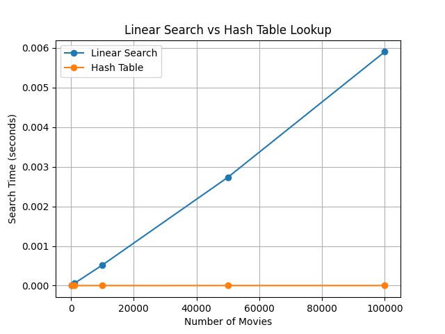
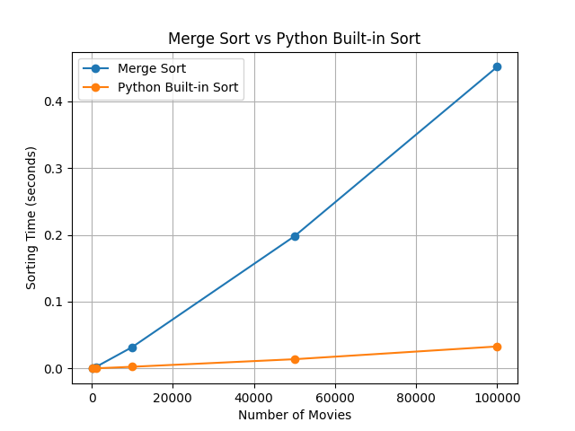

# Movie Recommendation System

## 1. Project Overview

The Movie Recommendation System is a Python-based Data Structures and Algorithms (DSA) project that recommends movies to users based on their previous ratings and movie similarity.

The project demonstrates the practical use of graphs, hash tables, heaps, recursion, searching, and sorting algorithms.

## 2. Objectives

- Build a movie recommendation system using Python.
- Represent movie similarity using a graph.
- Store movie and user information using hash tables (Python dictionaries).
- Generate recommendations based on movies liked by the user.
- Rank recommendations using a heap and Merge Sort.
- Compare the performance of Linear Search and Hash Table lookup.
- Compare Merge Sort with Python's built-in sorting algorithm.
- Analyze algorithm performance for increasing dataset sizes.

## 3. Technologies Used

- Python
- Python IDLE
- Matplotlib
- Data Structures and Algorithms

## 4. DSA Concepts Used

### Hash Table
Python dictionaries are used to store movie and user information. They allow efficient average-case lookup by movie ID or user ID.

### Graph
A movie similarity graph is constructed where each movie is a node. Two movies are connected when they share at least one genre.

### Heap
A heap is used to efficiently obtain the highest-scoring recommendations.

### Merge Sort
Merge Sort is implemented using recursion and the divide-and-conquer approach. Recommendations are sorted in descending order according to their scores.

### Linear Search
Linear Search is implemented and tested as a baseline search technique.

## 5. Recommendation Methodology

The recommendation process works as follows:

1. Select a user.
2. Read the movies rated by that user.
3. Treat movies with ratings of 4 or 5 as liked movies.
4. Find movies connected to the liked movies in the similarity graph.
5. Exclude movies already rated by the user.
6. Increase a candidate movie's similarity score whenever it is connected to a liked movie.
7. Add the movie's dataset rating to its similarity score.
8. Use a heap to obtain the top recommendations.
9. Use Merge Sort to demonstrate final ranking.

## 6. Project Structure

```text
Movie_Recommendation_System/
│
├── main.py
├── movie_data.py
├── graph.py
├── recommendation.py
├── sorting.py
├── performance.py
├── search_performance.png
├── sorting_performance.png
└── README.md
```

### File Description

| File | Purpose |
|---|---|
| `main.py` | Runs the recommendation system |
| `movie_data.py` | Stores movie and user data |
| `graph.py` | Builds the movie similarity graph |
| `recommendation.py` | Generates and ranks recommendations |
| `sorting.py` | Implements Merge Sort |
| `performance.py` | Measures search and sorting performance |
| `search_performance.png` | Search performance graph |
| `sorting_performance.png` | Sorting performance graph |

## 7. Sample Recommendation Result

For User 1, the system generated the following recommendations:

| Rank | Movie | Score |
|---:|---|---:|
| 1 | The Martian | 7.6 |
| 2 | Avatar | 7.4 |
| 3 | The Dark Knight | 6.9 |
| 4 | The Prestige | 6.7 |
| 5 | Titanic | 5.6 |

The recommendations are generated from graph similarity and movie ratings, while movies already rated by the user are excluded.

## 8. Performance Analysis

### Search Performance

| Number of Movies | Linear Search (sec) | Hash Table (sec) |
|---:|---:|---:|
| 100 | 0.00000670 | 0.00000160 |
| 1,000 | 0.00005280 | 0.00000130 |
| 10,000 | 0.00051940 | 0.00000200 |
| 50,000 | 0.00273370 | 0.00000270 |
| 100,000 | 0.00590080 | 0.00000290 |

Linear Search increased noticeably as the dataset grew, while Hash Table lookup remained very fast. This agrees with the theoretical average complexities of O(n) and O(1), respectively.

### Sorting Performance

| Number of Movies | Merge Sort (sec) | Built-in Sort (sec) |
|---:|---:|---:|
| 100 | 0.000301 | 0.000023 |
| 1,000 | 0.002262 | 0.000283 |
| 10,000 | 0.032105 | 0.002632 |
| 50,000 | 0.197936 | 0.013933 |
| 100,000 | 0.451380 | 0.033005 |

Merge Sort showed O(n log n) behavior, while Python's built-in sorting was substantially faster in this experiment because it is highly optimized.

## 9. Performance Graphs

### Search Performance



### Sorting Performance



## 10. Complexity Summary

| Algorithm / Structure | Average Complexity |
|---|---:|
| Linear Search | O(n) |
| Hash Table Lookup | O(1) |
| Merge Sort | O(n log n) |
| Heap insertion | O(log n) |
| Heap extraction | O(log n) |

## 11. Conclusion

The project demonstrates how appropriate data structures and algorithms can be combined to build a simple movie recommendation system. The graph represents movie similarity, hash tables provide efficient data access, a heap helps rank recommendation candidates, and Merge Sort provides an explicit sorting implementation.

The performance experiment showed that Hash Table lookup is much more efficient than Linear Search for large datasets. Merge Sort provides predictable O(n log n) performance, while Python's optimized built-in sorting function was faster in the practical experiment.

## 12. Future Scope

- Add more movies and users.
- Use weighted genre similarity.
- Incorporate user preferred genres directly into recommendation scoring.
- Add a graphical user interface.
- Use a larger real-world movie dataset.
- Include collaborative filtering or machine-learning-based recommendations.
